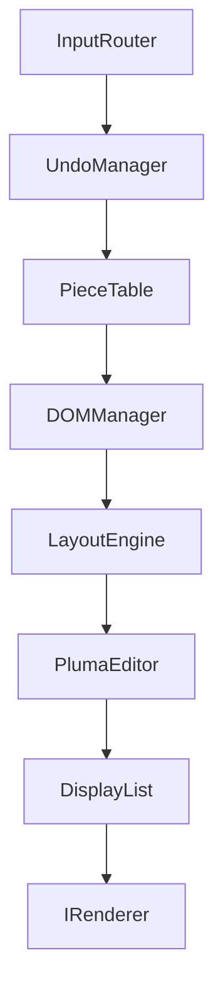

<div align="center">
  <h1>🪶 Lib-Pluma</h1>
  <p><b>A high-performance, platform-agnostic document composition engine for Horizon OS.</b></p>
  
  [](https://isocpp.org/)
  [](https://cmake.org/)
  [](LICENSE)
</div>

---

## 📖 Overview

**Lib-Pluma** is a document composition and rendering library. Designed explicitly to decouple text editing, Pluma provides a pure, memory-safe, and highly optimized core capable of rendering thousands of pages.

## ✨ Key Features

- 🏗️ **PieceTable Architecture**: Ultra-fast, immutable text storage that guarantees $O(1)$ undo/redo operations and minimizes memory footprint, even for gigabyte-sized books.
- 🎨 **Agnostic Rendering Pipeline**: Pluma is intentionally blind to the OS. It uses a `DisplayList` and an `IRenderer` interface, allowing you to inject Wayland/Cairo, OpenGL, or Vulkan renderers seamlessly.
- ⚡ **Viewport Virtualization**: Advanced spatial culling mathematically drops out-of-screen paragraphs and glyphs, enabling butter-smooth scrolling.
- 🧠 **Typographic Intelligence**: Built-in word-wrapping, widow/orphan line control, and paragraph balancing.
- ♿ **AT-SPI2 Accessibility**: Automatically translates the DOM tree into native accessibility semantic nodes (`A11yTreeBuilder`).
- 🔌 **Plugin Ecosystem**: Native bidirectional support for Markdown and physical PDF exportation.
- 🚀 **Zero Heap Fragmentation**: Internal `ObjectPool` and `ShaperCache` implementations avoid mid-frame allocations, guaranteeing deterministic performance.

## 🏗️ Architecture



## 🛠️ Building the Library

Pluma uses **CMake** and requires a C++20 compliant compiler. We highly recommend using **Ninja** for lightning-fast builds.

```bash
# Clone the repository
git clone https://github.com/HdrDevs/lib-pluma.git
cd lib-pluma

# Generate build files using Ninja
cmake -B build -G Ninja

# Build the library and tests
cd build
ninja
```

### 📦 Generating Debian Packages

You can easily generate `.deb` installation packages using the included CPack configuration. The process generates two packages: a `Runtime` package for the end-user (contains only the shared library), and a `Development` package containing headers and CMake exports (`-dev.deb`).

```bash
# Assuming you already ran cmake -B build -G Ninja
cd build
ninja package

# This will generate two files:
# 1. libpluma-0.4.0.deb        ← runtime (shared library)
# 2. libpluma-dev-0.4.0.deb   ← headers + CMake exports

# To install locally:
sudo dpkg -i libpluma-dev-0.4.0.deb
```

> **Note:** The `build/` folder is fully regenerable. If you delete it, just run
> `cmake -B build -G Ninja` again and all build capabilities (including `ninja package`) will be restored.

## 🚀 Quick Start Example

```cpp
#include <pluma/PlumaEditor.hpp>
#include <pluma/Render/CairoRenderer.hpp>
#include <pluma/Typography/DummyTypography.hpp>

using namespace pluma;

int main() {
    // 1. Initialize Shaper & Font
    auto shaper = std::make_shared<DummyTextShaper>();
    auto font = std::make_shared<DummyFontManager>()->getFont({"Inter", 12.0f});

    // 2. Create the Agnostic Editor
    PlumaEditor editor(shaper, font);

    // 3. Page Setup: A4 with 2cm margins (~1134 Twips)
    editor.setPageSize(PageSizes::A4);
    editor.setMargins(PageMargins(Twips(1134), Twips(1134), Twips(1134), Twips(1134)));

    // 4. Load Document
    std::string text = "Lib-Pluma Engine\nLorem ipsum dolor sit amet, consectetur adipiscing elit.";
    editor.loadText(text);

    // 5. Apply Rich Text Styles
    // Title: Bold, Centered, Underlined
    editor.applyStyle(0, 16, PropertyId::FontWeight, uint16_t(700));
    editor.applyStyle(0, 16, PropertyId::TextAlignment, TextAlign::Center);
    editor.applyStyle(0, 16, PropertyId::Decoration, TextDecoration::Underline);

    // Paragraph: Custom Font, Color, Alignment
    editor.applyStyle(17, 56, PropertyId::FontFamily, std::string("Roboto"));
    editor.applyStyle(17, 56, PropertyId::TextColor, Color(0xFF555555)); // Gray
    editor.applyStyle(17, 56, PropertyId::TextAlignment, TextAlign::Justify);

    // 6. Render to a Cairo Surface
    cairo_surface_t* surface = cairo_image_surface_create(CAIRO_FORMAT_ARGB32, 800, 1000);
    cairo_t* cr = cairo_create(surface);
    
    CairoRenderer renderer(cr);
    editor.render(renderer); // Instant virtualized render!

    return 0;
}
```


## 📜 License

This project is part of the **Horizon OS** ecosystem and is licensed under the GPL-3.0 License.
